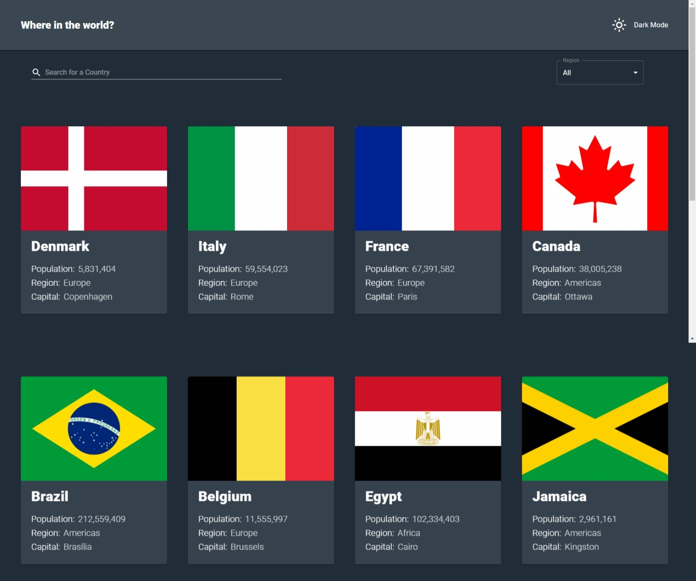

# Frontend Mentor - REST Countries API with color theme switcher solution

This is a solution to the [REST Countries API with color theme switcher challenge on Frontend Mentor](https://www.frontendmentor.io/challenges/rest-countries-api-with-color-theme-switcher-5cacc469fec04111f7b848ca).

## Table of contents

- [Overview](#overview)
  - [The challenge](#the-challenge)
  - [Screenshot](#screenshot)
  - [Links](#links)
- [My process](#my-process)
  - [Built with](#built-with)
  - [What I learned](#what-i-learned)
  - [Continued development](#continued-development)
  - [Useful resources](#useful-resources)
- [Author](#author)
- [Acknowledgments](#acknowledgments)

## Overview

### The challenge

Completed:

- See all countries from the API on the homepage
- Search for a country using an `input` field
- Filter countries by region
- Click on a country to see more detailed information on a separate page
- Click through to the border countries on the detail page
- Toggle the color scheme between light and dark mode

### Screenshot

### Links

- Solution URL: [Github](https://github.com/shalash23/fe-countries.git)
- Live Site URL: [Live URL](https://gilded-jalebi-6f9f67.netlify.app/)

## My process

### Built with

- React
- React Router DOM v6.6
- Material UI 5
- Framer Motion
- Vite
- React Hooks

### What I learned

How to efficiently use React Hooks and useMemo and Context providers and React Router.

### Continued development

Use of Redux for state management

### Useful resources

- [React Router](https://www.reactrouter.com) - This helped me in how to implement efficiently React Router DOM. Their training material was spot on
- [UseMemo & useCallback](https://www.joshwcomeau.com/react/usememo-and-usecallback/) - This is an amazing article which helped me finally understand useMemo and useCallback efficiently. I'd recommend it to anyone still learning this concept.

## Author

- Frontend Mentor - [@shalash23](https://www.frontendmentor.io/profile/shalash23)
- Github - [@shalash23](https://www.Github.com/shalash23)

## Acknowledgments

I would love to thank Frontend Mentor for providing those amazing challenges. They are the best resource to develop working knowledge.
